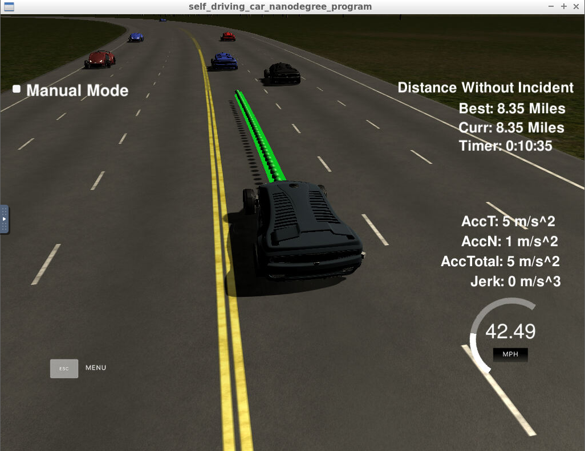
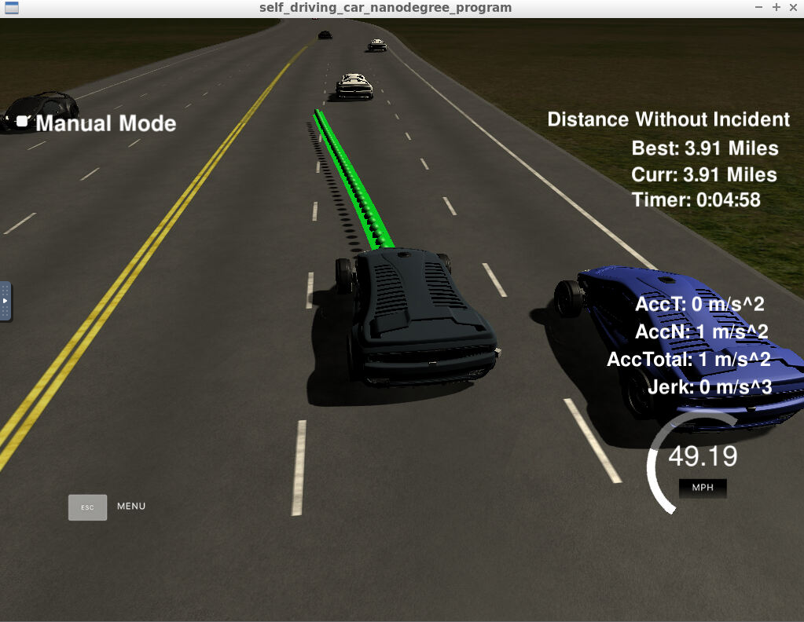

# CarND-Path-Planning-Project
Self-Driving Car Engineer Nanodegree Program

## Overview
The porject goal is to design a path planner that is able to create smooth, safe paths for the car to follow along a 3 lane highway with traffic. A successful path planner will be able to keep inside its lane, avoid hitting other cars, and pass slower moving traffic all by using localization, sensor fusion, and map data.
   
### Dependencies
* cmake >= 3.5
* make >= 4.1
* gcc/g++ >= 5.4
* [uWebSockets](https://github.com/uWebSockets/uWebSockets)

### Simulator
You can download the [Simulator](https://github.com/udacity/self-driving-car-sim/releases/tag/T3_v1.2) which contains the Path Planning Project.

## The Project
This is the moment when the car start to change the lane when it found the car ahead was slow.

### Compilation
#### The code compiles correctly.
Code was compiled without error.

### Valid Trajectories
Belows are the rubric items. I drove around 8.35 miles and found no faults.

* The car is able to drive at least 4.32 miles without incident.
* The car drives according to the speed limit.
* Max Acceleration and Jerk are not Exceeded.
* Car does not have collisions.
* The car stays in its lane, except for the time between changing lanes.
* The car is able to change lanes

## Reflection

